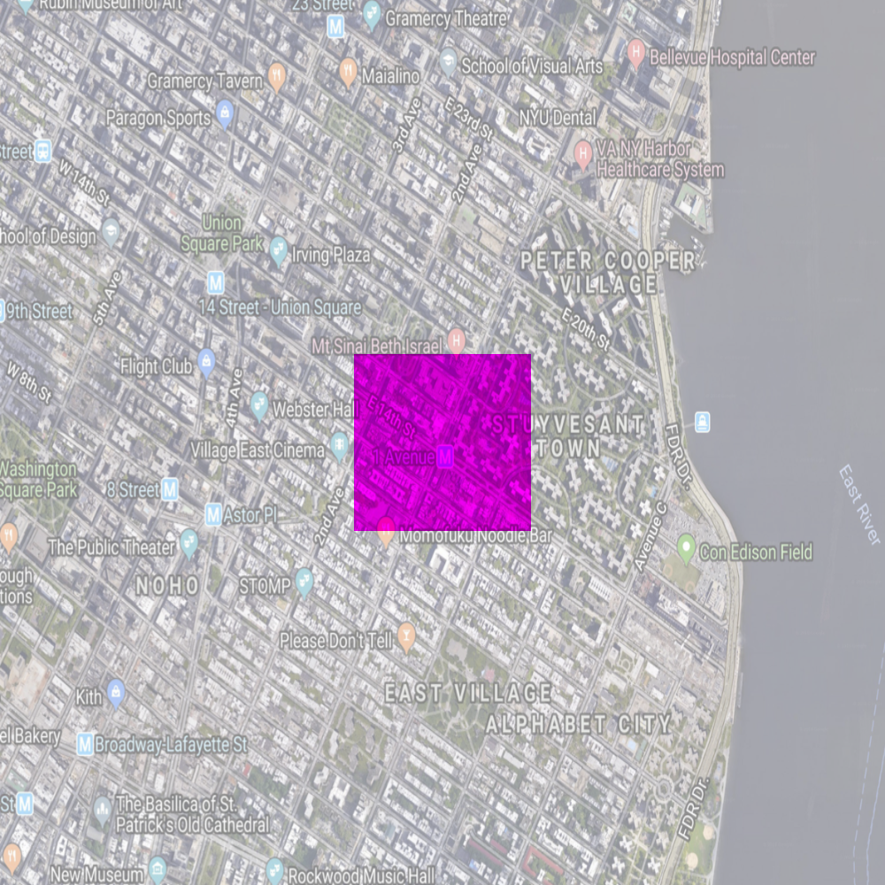
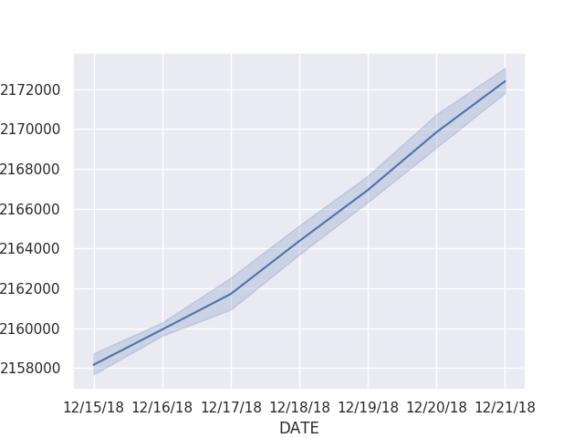
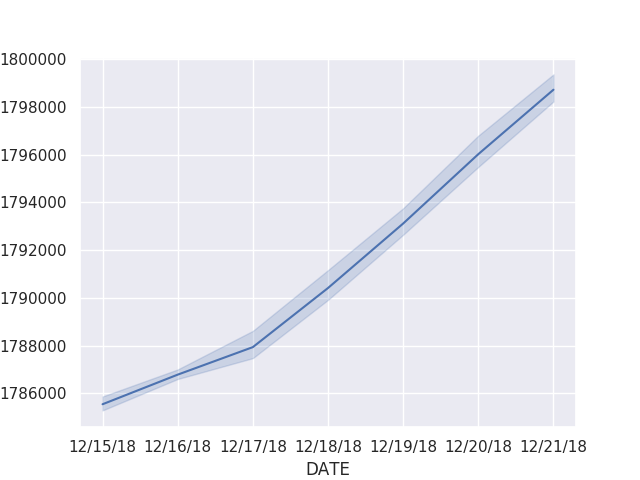
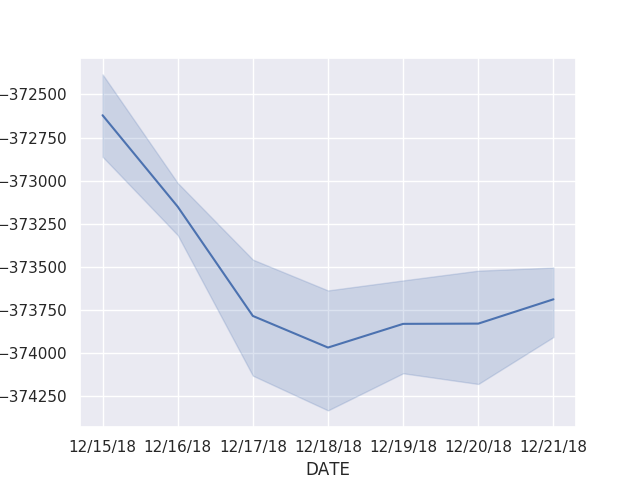
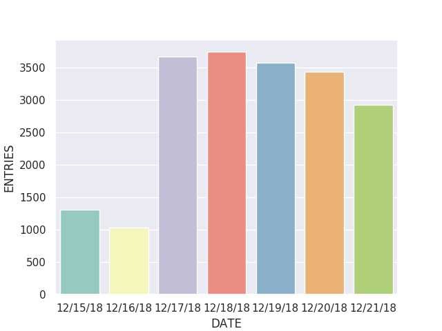
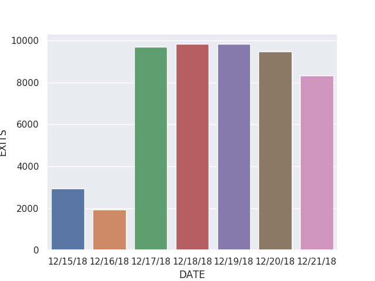

# L-train Project
For this project, I picked a neighborhood along the L-train:
First-Avenue and East 14th Street, Manhattan - East Village

HC 6: Neighborhood geoJSON Map 
Using the geoJSON mapper, I made a JSON file that includes the following features:
My L-train neighborhood marked as a region (e.g. polygon),
The L-train (marked as a gray line),
Other major transportation corridors (e.g. subway lines, major bus routes, or major roads) marked as lines, and
Transit stops on your subway lines and major bus routes (marked as points).

HC 7: Highlighted Map
For this program, I created a highlighted map around my station, with the region within about a 1/4 mile box at full brightness, the region that outside that box at 50% brightness.

HC 8: TurnStile Entries
/Turnstile
Using Python and Seaborn package, I made a PNG file of the station usage statistics on the L-train for the week of December 21st, 2018. 

HC 10: Morning Commute Snapshot
/Morning Commute
I wrote a program that takes a weekly turnstile data file and makes a graph of all the entries and a graph of all the exits during the morning commute for your L-train station for that data. The x-axis of my histogram was the days of the week, while the bars in my plot was the number of people entering the station between 5am and 9am (i.e. subtract the cumulative total at 5am from the cumulative total at 9am, or the closest 4-hour block measured for your station). Similarly, the bars in the second plot was the exits from my station over the week.

HC 12: Catchments for L-train Stations
/Subway
A Voronoi diagram divides a region based on the distance to a set of input points. This simple idea has many applications, one of the most famous was the work of John Snow to study the 1854 cholera outbreak. My focus was to map access to public resources and transit.

